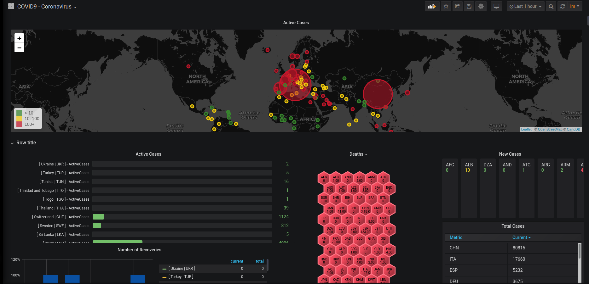
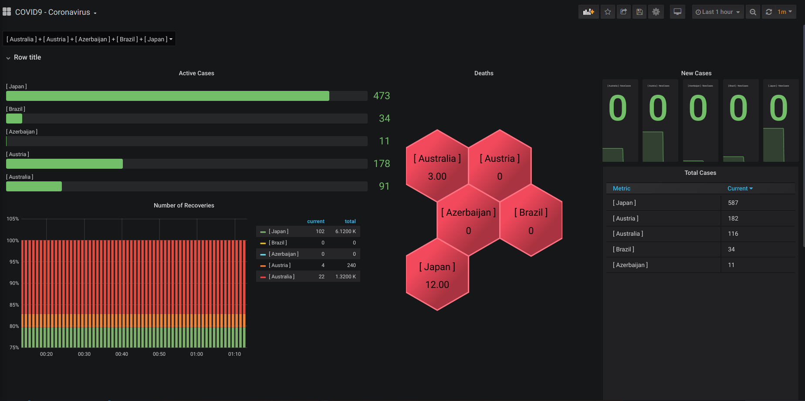
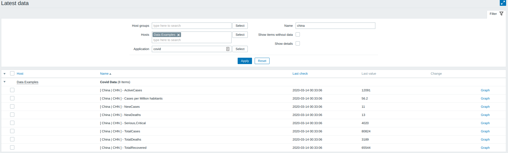

# covid19-monitor
Gets information involving CORONAVIRUS - COVID19 casualities and presents to JSON and Zabbix





### Usage

```
git@github.com:rickkbarbosa/covid9-monitor.git
pip install -r requirements.txt
```

### To Zabbix

Clone repository in a plase acessible by Zabbix (usually, /usr/lib/zabbix/externalscripts)
install python requirements on requirements.txt
Import template to zabbix dashboard (zabbix/zabbix_template.xml - Zabbix server 4.0 and above)
Add template to a host



### To grafana

* Install Zabbix Plugin datasource by [Alexander Zobnin](https://grafana.com/grafana/plugins/alexanderzobnin-zabbix-app)
* Install Polystat Grafana plugin(https://grafana.com/grafana/plugins/grafana-polystat-panel/installation)
* Install Multistat Grafana plugin(https://grafana.com/grafana/plugins/michaeldmoore-multistat-panel)
* Import dashboard _grafana_dashboard.json_ to grafana 
* Points your Zabbix datasource

### License

See LICENSE


### TODO

* Adjust unformatted Country Names on Worldometer +  IBAN (Eg. "S. Korea"  and "S. Afria" instead "South Korea" and "South Africa" )


### Thanks 

* [Zabbix Brasil](https://t.me/ZabbixBrasil) , for reviews and help with cleanup/garbage collecting
* Everaldo Santos Cabral, for Suggested applications organiztions and Zabbix 4.0 retro-compatible template